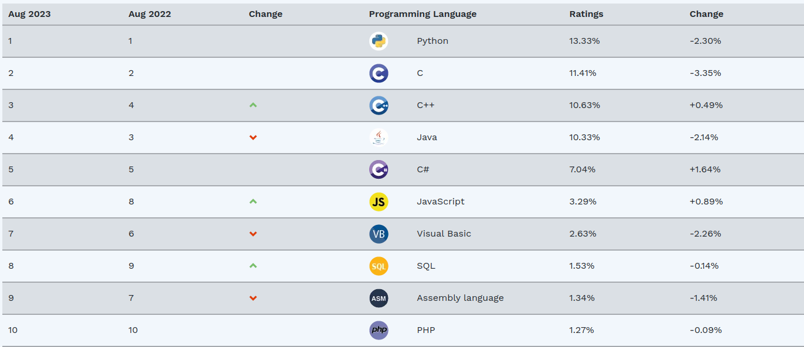
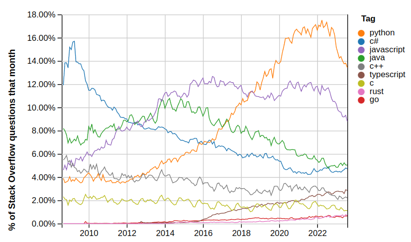
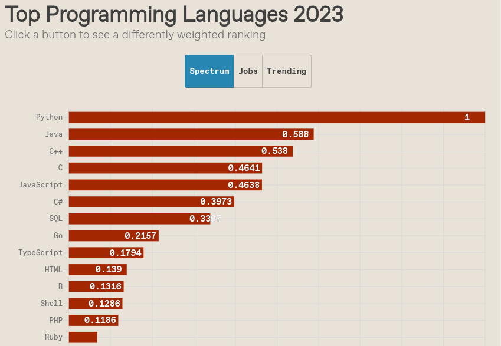
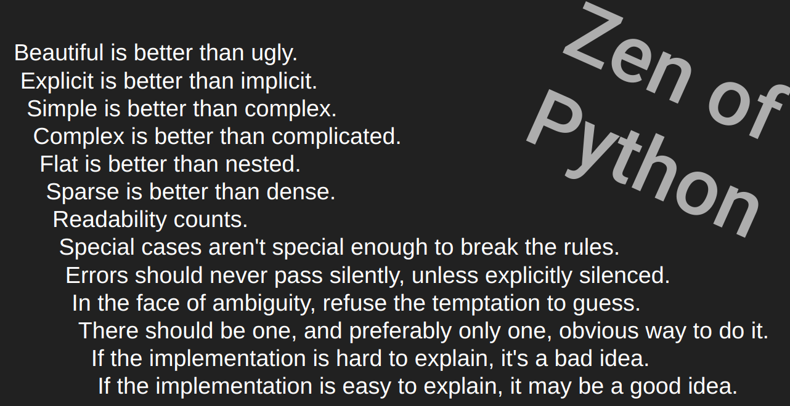

# Python for .Net Developers
This presentation was created by Mike Rapa for a presentation at TechBash 2023. All presentation files are on
[GitHub](https://github.com/mikerapa/Python-for-.Net-Developers)

## About Python
Python is a high-level, interpreted 
scripting language. Python was designed to be highly 
readable, with an emphasis on well-understood keywords, rather than
punctuation and special characters. Python uses fewer language constructs 
compared to other high-level programming languages.

Python was created by Guido van Rossum in 1991. Python has been open source
from its inception. The language and its releases are managed by the [Python Software Foundation](https://www.python.org/psf/about/).

While there are multiple implementations of the Pythong language, CPython is by far the most popular. 
CPython is the reference implementation of the Python language. CPython is written in C and Python. 
Since the project is open source, you can view the code and there are ways to contribute to the project.

## Python's Growing Popularity 
Python has been growing in popularity, at a time of vast choices. By Some measures, Python is the
most popular programming language used today.

### Tiobe Index
The following chart shows the popularity of multiple programming languages, as measured by the [Tiobe Index.](https://www.tiobe.com/tiobe-index/)
This data is from August 2023. According to the Tiobe Index, Python remains the most popular
programming language, sitting above languages like C and Java, which had previously been the most popular. 
See more about the Tiobe Index methodology [here](https://www.tiobe.com/tiobe-index/programminglanguages_definition/). 
This index has special criteria for determining what is a programming language. For example, HTML is not considered a 
programming language.




## Stack Overflow
Stack Overflow is an extremely popular question and answer site for software development, and other topics. The trending
chart below shows the popularity of Python, C, C#, C++, Go, Java, JavaScript, Rust, and TypeScript.
The source of this data can be found [here](https://insights.stackoverflow.com/trends?tags=c%23%2Cpython%2Cjava%2Cgo%2Cjavascript%2Ctypescript%2Crust%2Cc%2B%2B%2Cc). 
The data below was captured in August 2023. 




## IEEE Spectrum
IEEE Spectrum is a magazine and website that covers topics related to electrical engineering, software engineering 
and computer science. See [this post ](https://spectrum.ieee.org/the-top-programming-languages-2023)from IEEE Spectrum 
to review the parameters of this ranking from August 2023. 



## Zen of Python
Python has a set of guiding principles, which are referred to as the Zen of Python. The following is a simplified 
version of those principles. You can see a more complete version [here](https://en.wikipedia.org/wiki/Zen_of_Python).




## Ecosystem Comparison
Both .Net and Python have thriving communities and rich tooling. The chart below shows a high-level
comparison.

| |.Net|Python|
|------|-----|-------|
|Primary Uses|Desktop, web, gaming, mobile|Data science, web, artificial intelligence, scripting, automation |
|Package Repository|NuGet|PyPi|
|Package Management Tool|Nuget Package Manager|PIP|
|Integrated Development Environment|Visual Studio, VS Code, Ryder|PyCharm, VS Code|
|Web Frameworks|ASP .Net, Blazer|Flask, Django, Pyramid, FastAPI|
|Testing Frameworks|MSTest, NUnit|PyTest, Testify, Unittest, DocTest|
|Cloud Platform Support|AWS, Azure, Google Cloud|AWS, Azure, Google Cloud|
|Desktop application development|WinForms, WPF, MAUI|PyQT, TKinter, Kivy|


## Code Example
The following code example shows a simple Python program. This program opens a json 
file containing data about which teams have won the FIFA World Cup. The winners are 
simply printed to the console.


```python
import json
from pydantic import BaseModel


class Winner(BaseModel):
    country: str
    year: int
    competition: str


def get_world_cup_data() -> list[Winner]:
    data = json.load(open("worldcupdata.json", "r"))
    winners = [Winner(**w) for w in data]
    return winners


def print_world_cup_data(data: list[Winner]):
    # sort by year before printing
    data.sort(key=lambda w: w.year)
    for winner in data:
        print(f"{winner.year} - {winner.country} ({winner.competition})")


def get_winners_by_country(country_name: str) -> list[Winner]:
    return [winner for winner in get_world_cup_data() if winner.country == country_name]


if __name__ == '__main__':
    data = get_world_cup_data()
    print_world_cup_data(data)
```

Most Python applications start with ``` if __name__ == '__main__': ``` and this line 
of code probably looks odd for anyone coming to Python from another language.
The Python interpreter will execute the code in this block if the file is run directly.
There's a somewhat complex reason behind this, but you can just think of it as an equivelant 
the ```Main``` method in C#.

Notice that the class, function and for loops are defined without using curly braces.
Python uses indentation to define blocks of code. 

The ```get_winners_by_country``` function uses a special type of syntax called 'list comprehension'
to filter the list of winners. Surrounding the return value in square brackets indicates that a list will 
be returned. See [the Python documentation on comprehension](https://docs.python.org/3/tutorial/datastructures.html#list-comprehensions) 
for more information. In C#, you would typically use a linq statement to filter a list of objects. List comprehension in Python and linq in C# can solve some of the same problems and they are both declaritive, but they are fundamentally different in other ways.

## Web API Example
The following example uses a package called [Flask](https://pypi.org/project/Flask/) to create a simple web API. 
Flask is a popular web framework, but there are plenty of other options. To add Flask to your project, you can 
run ```pip install flask``` from the command line. To run this example, you can run ```flask run``` 
from the command line.


```python
from flask import Flask, request
from random import randint

app = Flask(__name__)


@app.route("/")
def hello():
    return "Hello, World"

@app.route("/nums")
def get_nums():
    limit: int = request.args.get('limit', default=10, type=int)
    return [randint(0, 1000) for _ in range(limit)]
```

## Types
Types in python are dynamic. This means that the type of a variable is 
determined at runtime. The interpreter infers the type when a value is set.

To see how the type inference works, you can run the following code.

```python
print([type(v) for v in [1, 1.0, True, [], {}, None, "1"]])
```

The output of this code is as follows: 
```[<class 'int'>, <class 'float'>, <class 'bool'>, <class 'list'>, <class 'dict'>, <class 'NoneType'>, <class 'str'>]```

Python has the concept of type hints, which were introduced in Python 3.5. See the
[documentation on python.org](https://docs.python.org/3/library/typing.html) for 
more details. Type hints are not like type definitions in C#, Java or C, because
the type hints are not enforced by the interpreter. Type hints are used by IDEs
and other tools to provide intellisense and other dev-time features.

Consider the following code example:

```python
name_string: str = "Luca"
name_string = 44
print(name_string)
print(type(name_string))
```
The name_string variable is declared with a string type hint and it is initialized
with a string value. However, the value can be subsequently changed to an integer
by setting the value to a number. A development tool such as PyCharm or VS Code
will display a warning, but the code still executes without error. When the final
line executes, the value of name_string is 44 and the type is int.


## Packages
Python has an enormous open source community with a vast number of packages available. [PyPi.org](https://pypi.org) is the
largest package repository for Python packages. The most commonly used package management tool is called [PIP](https://pip.pypa.io/en/stable/).

## Python in Science, Data Science, Mathmatics and Statistics 
Of course, there are many programming languages capable of handling and processing data. Python is a particularly
popular choice for data science because it's considered easily approachable for those without a software development
background. Python also has a rich ecosystem of packages for data science, which are created and maintained by the 
community. Packages such as Pandas and NumPy are ubiquitous in the data science community.

For many data professionals, the code they write is intended to analyze, process and visualize data. Jupyter Notebooks
is a very popular data interactivity tool used for data science. Jupyter Notebooks allow the user to create a document
which contains interactive code, visualizations and mark down text. There are also alternatives to Jupyter Notebooks,
which have
features for exceptionally large data sets, cloud processing and collaboration. To learn more about Jupyter Notebooks,
I recommend following [Rob Mulla](https://www.youtube.com/watch?v=5pf0_bpNbkw) on Youtube or on other platforms.

This repository includes a basic example of Jupiter Notebooks. See the 'WorldCup.ipynb' file in the root of this 
repository.

## Performance
Python has a reputation for being slow. This is true in some cases, but not all. Python is an interpreted language,
which means that the code is not compiled to machine code before it is executed. The Python interpreter is written
in C, which is a compiled language. The interpreter is responsible for converting Python code to machine code
at runtime, which impacts run-time performance. 

However, evaluating runtime performance is a bit more complex than just 
'compiled vs interpreted.' The performance of most applications is more highly impacted by IO and network latency than 
language run-time. 
Built-in functions and popular libraries are developed in C, and have been highly optimized for performance. This is why
Python is so highly regarded for data science and other applications that require high performance, while the language
itself has a reputation for being slow.

Python is very extensible. You can write your libraries in C, Rust, Go, or other languages if your projects requires
higher performance than Python alone can provide. Many popular librabries in the Python echosystem are written in C, or other
compiled languages.

Recent versions of Python (3.10 and 3.11) included significant performance optimizations. 


